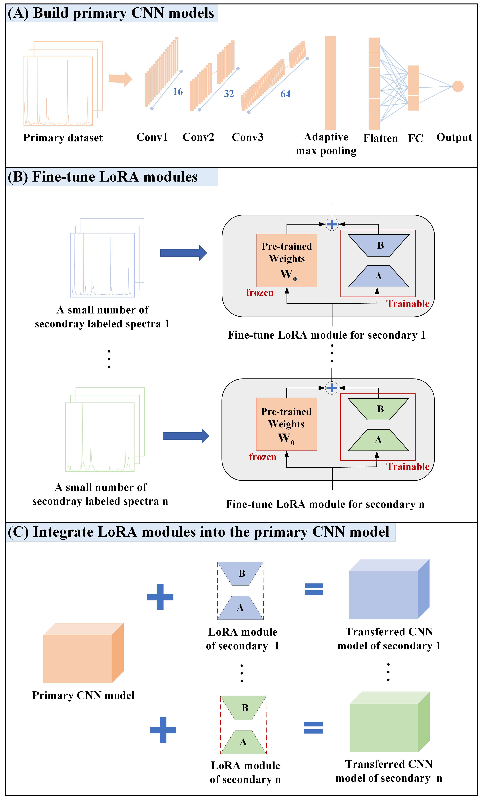

## LoRA-CT

This is the code repo for the paper *Calibration Transfer among Multiple Raman Spectrometers via Low-Rank Adaptation*. a Low-Rank Adaptation-based Calibration Transfer method (LoRA-CT) is proposed to perform parameter-efficient fine-tuning of deep learning models toward new Raman spectrometers with very few samples. When we want to transfer the primary CNN model built with a lot of effort to multiple secondary spectrometers, we only need to use a small number of labeled spectra from each secondary spectrometer to obtain the LoRA module separately and then combine each LoRA module with the primary CNN model separately to achieve the transferred model for multiple secondary spectrometers.
    

## Package required: 
We recommend to use [conda](https://conda.io/docs/user-guide/install/download.html).
- [python3](https://www.python.org/)
- [pytorch](https://pytorch.org/) 

By using the [`environment.yml`](https://github.com/jiahuilai0220/LoRA-CT/blob/master/environment.yml) file, it will install all the required packages.

    git clone https://github.com/jiahuilai0220/LoRA-CT.git
    cd LoRA-CT
    conda env create -f environment.yml
    conda activate LoRA-CT

## Primary calibration model paths
The CNN quantitative models for different datasets are customized and cannot be public for different datasets; this study focuses on the calibration transfer performance of the LoRA-CT method, so the best primary calibration model paths are provided directly in each dataset file.（for example：https://github.com/jiahuilai0220/LoRA-CT/blob/main/Blended-olive-oil/oil-best_model_cnn_x1.pt）

## Fine-tuning
To fine-tune the primary CNN model, we need to prepare the labeled spectra for each secondary spectrometer. The fine-tuning process can be done by running the `lora-fine-tuning.ipynb` file in the corresponding dataset folder. 

## Calibration Transfer
After obtaining LoRA modules, first merge LoRA modules with the primary CNN model and finally test LoRA-CT calibration transfer performance.The calibration transfer can be done by running the `CT-Test.ipynb` file in the corresponding dataset folder. 

## Clone the repository and run it directly
[git clone](https://github.com/jiahuilai0220/LoRA-CT)

## Information of maintainers
- zmzhang@csu.edu.cn
- 232311025@csu.edu.cn